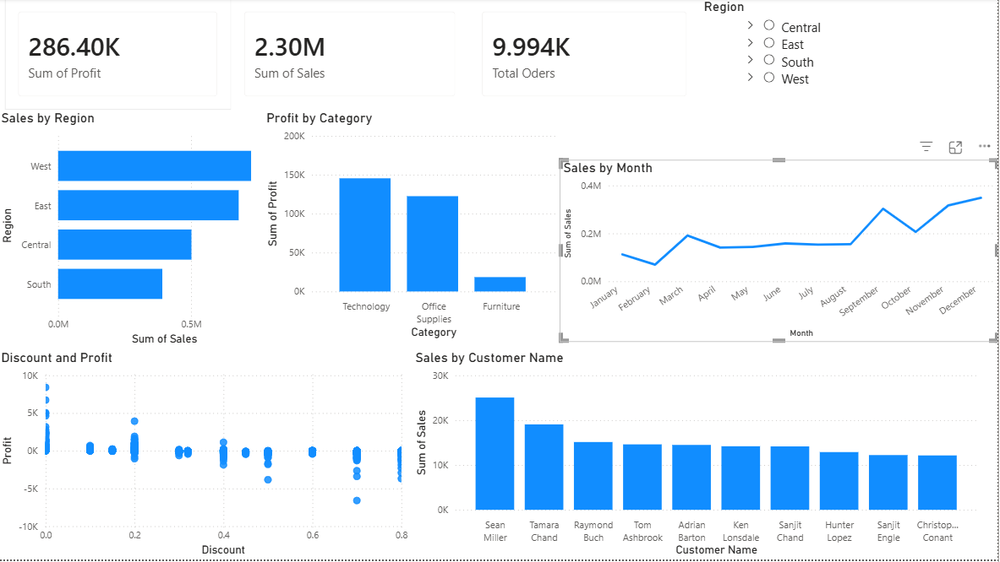

# Superstore Sales Analysis
## Project Overview
This project analyzes Superstore sales data using SQL and Power BI.
The goal of this analysis is to identify:
- Sales performance by region
- Profitability by category
- Impact of discounts on profit
- Top customers and products
- Sales trends over time
---
## Tools Used
- SQL
- Power BI
- Excel
---
## Key Insights
- High discounts negatively affect profit
- Technology category generates high sales
- Some products create losses despite strong sales
- Certain regions outperform others in profitability
---
## Dashboard Preview

---
## Power BI Dashboard
[View Dashboard](https://app.powerbi.com/links/XM4thv3fpe?ctid=a43125d1-0f89-4fa4-99ab-5474c89fdd42&pbi_source=linkShare)

